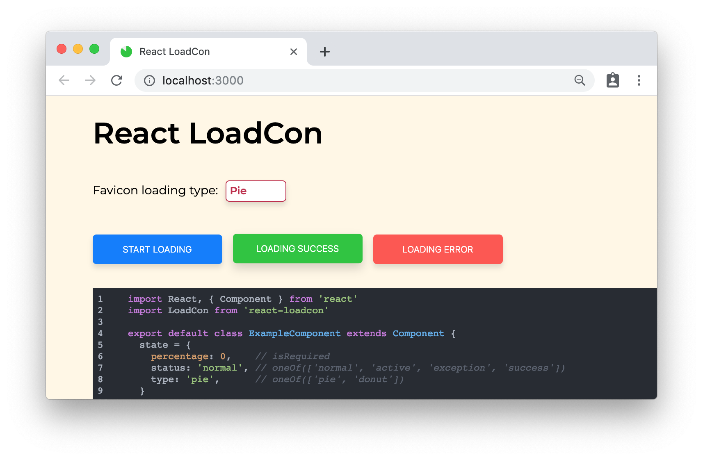

# react-loadcon

> React component to manipulate the favicon, as a loading or progress indicator, for now. The idea of "Favicon as DOM" is under construction.

[](https://www.npmjs.com/package/react-loadcon) [](https://standardjs.com)



## Why bother?

When it comes to a huge file loading or download in a tab, a tiny progress indicator on favicon could be an interesting but also considerate UX experience. The idea comes from a long time ago and has been realized by so many open-source developers, and it comes back to me when try to solve this [good first issue](https://github.com/mozilla/send/issues/803) for the Mozilla Send.

So here is React-LoadCon for React community, now this tiny project can only use canvas to draw dynamic images and replace the <meta favicon /> tag, which is extremely tedious, but it plans to be a more general tool to offer `Favicon as DOM`. [dom-to-img](https://github.com/tsayen/dom-to-image) could be introduced to simplify the covert process.

[Live Demo Here](https://foreseaz.github.io/react-loadcon/)

And if you find the idea interesting, [](https://spectrum.chat/favicon)


## 🚀 Installation

```bash
npm install --save react-loadcon
```
or
```bash
yarn add react-loadcon
```

## 🖲 Usage

Add `<LoadCon />` in any component, it will render the loading favicon according to the status. Feel free to use it with your Server-Side Rendering Components, since LoadCon would only trigger after `componentDidMount`.

```JavaScript
  import React, { Component } from 'react'
  import LoadCon from 'react-loadcon'

  export default class ExampleComponent extends Component {
    state = {
      percentage: 0,    // isRequired
      status: 'normal', // oneOf(['normal', 'active', 'exception', 'success'])
      type: 'pie',      // oneOf(['pie', 'donut'])
    }

    componentDidMount () {
      this.apiCall()
    }

    apiCall = () => {
      this.setState({ status: 'active' })
      fetch(url)
        .then(res => return res.json())
        .then(data => {
          // normal loading
          this.setState({ status: 'normal' })

          // loading with success
          this.setState({ status: 'success' })
          setTimeout(() => {
            this.setState({ status: 'normal' })
          }, 1500)
        })
        .catch(e => {
          this.setState({ status: 'exception' })
          setTimeout(() => {
            this.setState({ status: 'normal' })
          }, 1500)
        })
    }

    render () {
      return (
        <LoadCon
          percentage={this.state.percentage}
          status={this.state.status}
          type={this.state.type}
        />
      )
    }
  }
```

## 🧬 Props

OPTION | TYPE | DEFAULT | DESCRIPTION
------ | ---- | ------- | -----------
percentage | `number` |  `0` | the percentage of loading progress for LoadCon
type | `oneOf(['pie', 'donut'])` | `pie` | the theme of LoadCon, now has `PieCon` and `DonutCon`, and more themes will be added soon
status | `oneOf(['normal', 'active', 'exception', 'success'])` | `normal` | load status of LoadCon, `normal` reset to default favicon, `active` set LoadCon according to the type prop, `exception` set ErrorCon and `success` set SuccessCon.
color | `string` |  `#25c639` | color of loading indicator in hash format.
background | `string` |  `#eee` | color of background in hash format.
shadow | `string` |  `#fff` | color of 2 pixals border in hash format
donutWidth | `number` | `8` | width of DonutCon indicator.


## 📝 License

MIT © [foreseaz](https://github.com/foreseaz)
